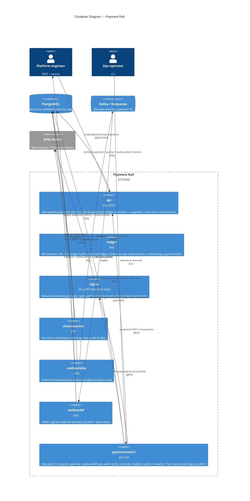

# C4 — Level 2: Containers

The runnable pieces of Payment Rail and the stores/rails they talk to. Each container
is a separate binary under `cmd/`. One deliberate wrinkle (ADR-0006): the double-entry
ledger runs **in-process** — `api` links `internal/ledger` so a payment and its journal
entry commit in one atomic Postgres transaction, and `cmd/ledger` stays an idle M0
skeleton held for ADR-0001's target-state gRPC split.

## Notes

- **The ledger is a library, not a service (ADR-0006).** ADR-0001's gRPC-between-services
  topology remains the target end state, but the shipped payment path has no
  api→ledger network hop: a payment and its journal entry must commit in **one**
  Postgres transaction, so callers link `internal/ledger` directly. `cmd/ledger`
  stays an idle skeleton binary reserved for the eventual split.
- **Postgres** owns the ledger, the transactional outbox, the idempotency store,
  webhook delivery state, approval/velocity state, and the append-only hash-chained
  audit log — a single relational boundary makes crash-safety tractable.
- **Outbox → `outboxrelay` → Kafka** gives at-least-once event delivery (ADR-0011):
  each state change appends its event row in the same transaction (payment events
  from `api`, settlement events from `chainwatcher`), and the relay claims,
  publishes verbatim, and marks sent in one transaction. Consumers must be
  idempotent — `webhookd` dedupes on the event id.
- The **signer** is deliberately isolated: no database, no chain access — it only
  signs well-formed payloads under per-key spend limits, on a loopback-only gRPC
  endpoint (mTLS and HSM/MPC custody are the recorded pre-mainnet upgrade,
  ADR-0013). Its only caller is `paymentrailctl`'s submit path, whose chain adapter
  performs the broadcast and aborts on a sender mismatch (ADR-0010) — key material
  never leaves the signer.
