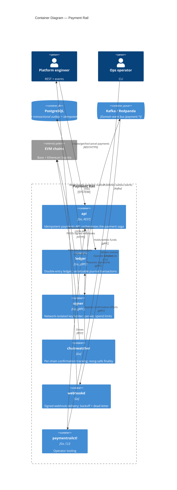

# C4 — Level 2: Containers

The runnable pieces of Payment Rail and the stores/rails they talk to. Each container
is a separate binary under `cmd/`.

## Notes

- **Postgres** owns the ledger, the transactional outbox, and the idempotency
  store — a single relational boundary makes crash-safety tractable.
- **Outbox → Kafka** gives at-least-once event delivery; consumers must be
  idempotent (documented per milestone M4).
- The **signer** is deliberately isolated: it has no database and only signs
  well-formed payloads, so compromising `api` does not directly move funds.
