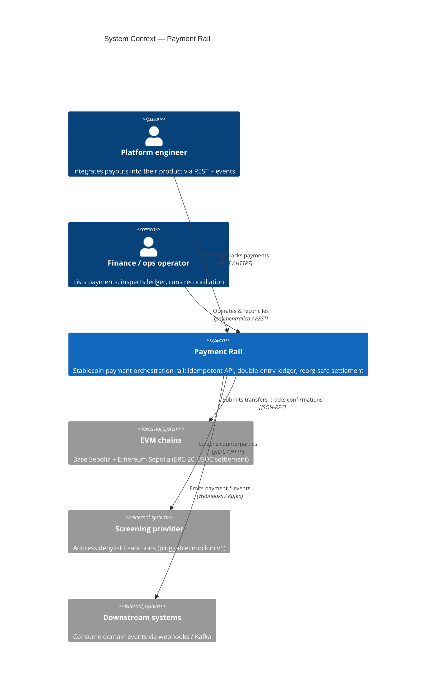

# C4 — Level 1: System Context

How Payment Rail sits between the people/systems that use it and the external rails
it depends on. (C4 model: https://c4model.com)

## Notes

- The chain is a **settlement rail**, not the database. Internal truth lives in
  the double-entry ledger; the chain is reconciled against it.
- Screening and chain access are **ports** with adapters, so providers/chains
  can be swapped (Solana is designed-for but not built in v1).
